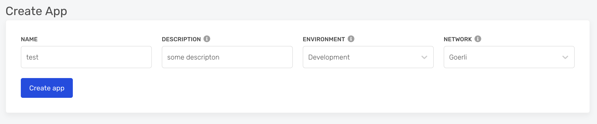
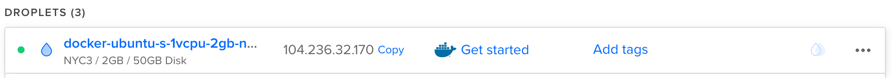
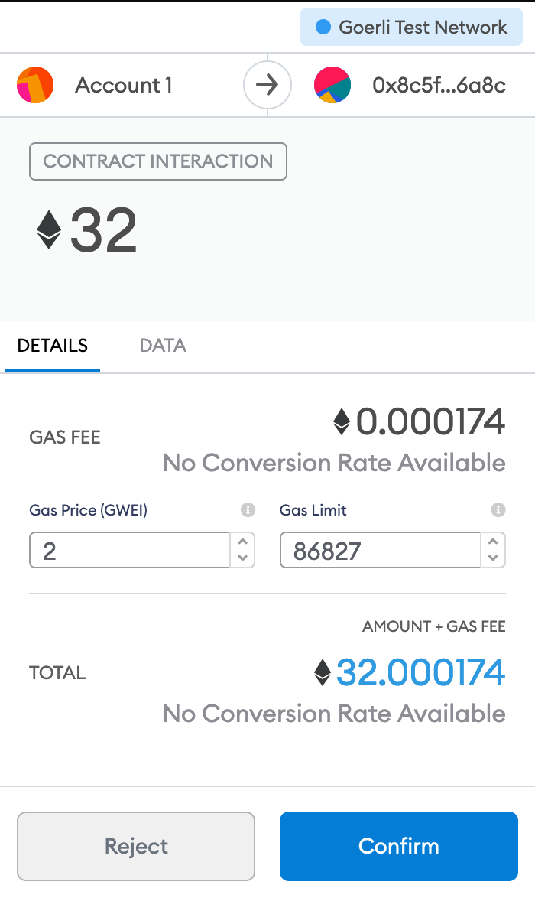

Etherum is one of the leading crypto projects (second to bitcoin). In December 2020 Etherum released the first stage of Etherum 2.0. The biggest difference is that there is no need for an expensive calculation to validate blockchain transactions, miners can earn money only by staking their coins. This is a shift from proof-of-work to [proof-of-stake](https://ethereum.org/en/eth2/staking). You can read more on the vision [here](https://ethereum.org/en/eth2/vision).

### What does it mean for you?

If you want to "mine" eth you don't need to invest in an expensive server farm anymore, all you need is to stake at least 32ETH and run the eth2 clients for as little as $10/month. In return you will earn passive income - currently, [around 10%](https://docs.google.com/spreadsheets/d/15tmPOvOgi3wKxJw7KQJKoUe-uonbYR6HF7u83LR5Mj4/edit#gid=842896204). The more people stake their eth the lower the interest rate will be. You can find the latest rate [here](https://launchpad.ethereum.org).
In case you have at least 32ETH and you are OK to stake it for at least a year, probably more, until Etherum reach their [next phase](https://docs.ethhub.io/ethereum-roadmap/ethereum-2.0/eth-2.0-phases), you can use this guide to learn how to do it.
This solution is great if you want to hold your ETH coins for 1-2 years and earn passive income by doing so.
**This guide is for educational purposes only.**

### Install Metamask

We will use Metamask as our etherum wallet. You can install it from [here](https://metamask.io). Do not lose the password and paraphrase for your wallet.  
After you finished installing your wallet, make sure you select the `goerli` (test) network.


### Get Goerli

Since we are using the Goerli test network, we will need some coins to play with. To be a validator you will need ether. You can get test ether coins from [here](https://faucet.goerli.mudit.blog). All you need is to tweet your **goerli** wallet address. Make sure you ask for at least 32 eth (the minimum for a validator node).

### Become eth2 validator

Go to the Ethereum 2.0 pyrmont (test) [launchpad site](https://pyrmont.launchpad.ethereum.org) and click on `GET STARTED`. Read all the warnings and information, make sure you understand them all.  
The next step is to [select your client](https://pyrmont.launchpad.ethereum.org/select-client) - choose [lighthouse](https://github.com/sigp/lighthouse).  
Select how much eth you want to stake, 32 eth is the minimum.
You will also need to [select your local machine's operating system](https://pyrmont.launchpad.ethereum.org/generate-keys) to [download the CLI](https://github.com/ethereum/eth2.0-deposit-cli/releases/). In this post I use Mac, but you can choose whatever OS you use. Open and extract the CLI folder you downloaded from GitHub. Inside that folder, you will find a `deposit` file. Run this file using: `/path/to/deposit new-mnemonic --num_validators 1 --chain pyrmont`. Please note:  
`/path/to/deposit` is whenever your downloaded `deposit` file is.  
`--num_validators` has the number of validators you want to have. Each validator is 32ETH.  
`pyrmont` is the test network. You should change it if you want to work on the main network (aka real money).

Here is example of the output you will have:

```bash
> /Users/sagivo/Desktop/eth2deposit-cli-ed5a6d3-darwin-amd64/deposit new-mnemonic --num_validators 1 --chain pyrmont
Please choose your mnemonic language (czech, chinese_traditional, chinese_simplified, english, spanish, italian, korean) [english]: english
Type the password that secures your validator keystore(s):
Repeat for confirmation:
```

You will be asked to choose a validator password. Do not lose this password, you will need it to get your money back at some point. **This is not your wallet password**, select a new password just for the validator client. After selecting the password you will get a seed phrase to store in case you lost your validator password. Store the seed phase in a secure location as well.  
If everything went well you should see a hippo(?) image.  


Open the folder with the keys. In this folder you will find a few files:  
`deposit_data-[some number].json` - this is the information for your deposit.  
`keystore-[some number].json` - you will have one or more files based on the number of validators you selected.
In this stage, you have all you need to install the local clients. Keep this window open, we will get back to it after we install the clients.

### Etherum client components

Now that you staked your eth, you will need 3 nodes to become ETH 2.0 validator:

- **ETH 1.0 client**: this client will listen to the Etherum 1.0 network. You can either run a local client or use a free 3rd party node. To save resources and keep this post simple, I'm using a free [alchemyapi.io](https://dashboard.alchemyapi.io/signup?referral=5f4b22ad-1a24-46af-ab1c-4475e8fe177d) node. You can find more 3rd party options [here](https://ethereumnodes.com).
- **Beacon node**: etherume 2.0 client.
- **Validator client**: to validate eth2 transactions.

### Create eth1 client

You can either create a local eth1 client or use a 3rd party node instead. Let's use a 3rd party today. Open a free [alchemyapi.io](https://dashboard.alchemyapi.io/signup?referral=5f4b22ad-1a24-46af-ab1c-4475e8fe177d) and [create an app](https://dashboard.alchemyapi.io/apps). Make sure you select the `Goerli` network for your eth1 node.



After the app has been created go to the app's page and click on `VIEW KEY`, you will need to copy the HTTP URL for the beacon node.


### Hosting your beacon node and validator client

You can run your beacon node and validator client on a local computer. Beacon nodes are intended to be high-performance, highly available platforms that can support connections to numerous validator clients and maintain ongoing p2p connectivity with other beacon nodes. As such, their hardware requirements are anticipated to be server-grade CPU/SSD/networking connections.  
Your server needs to be available 24/7 or you will accrue penalties and lose ETH. This is why I prefer running my nodes on a hosted cloud server. In this tutorial, I choose [Digitalocean](https://m.do.co/c/29d9028f31d1). After playing with multiple specs, I've found that you can run your beacon node and validator client for just \$10/month. Use [this link](https://m.do.co/c/29d9028f31d1) to sign up for digitalocean and get $100 credit! This should cover your Etherum staking expenses a while :)

### Creating a digitalocean Droplet

From your Digitalocean account, create a [new droplet](https://cloud.digitalocean.com/droplets/new).  
Choose the `Ubuntu` droplet. This will create a UNIX server running Ubuntu. 

Select the $10/mo plan. The \$10/month spec is the bare minimum you should choose. If you want to choose a stronger instance go for it.


Setup SSH access under the `Authentication` section. This is important to be able to access your server from your terminal.  
You can leave the other settings as-is.  
Once your droplet setup is completed copy the ip address from the dashboard.  


### Setting up your cloud server

By now you should have a running digital ocean server and you should have generated `validator_keys` locally using the CLIt. Now let's access your digital ocean machine to set it up.
First, let's copy your local `validator_keys` folder to your hosted server.

```bash
scp -pr /path/to/your/local/validator_keys root@digital_ocean_ip:/validator_keys
```

- `/path/to/your/local/validator_keys`: the path for your local folder containing the generated validator keys.
- `digital_ocean_ip`: your digitalocean machine's IP.

Now that we copied the keys to the droplet (digitalocean instance), let's SSH into this machine.

```bash
ssh root@digital_ocean_ip
```

- `digital_ocean_ip`: your new machine's IP.

The first (optional) step is to enable better metrics on the machine to track later in digitalocean. This will let you inspect CPU, memory, disk I/O, and other metrics in the digitalocean dashboard.

```bash
curl -sSL https://repos.insights.digitalocean.com/install.sh | sudo bash
```

### Install Lighthouse

In this step, we will install lighthouse on your new server. [Lighouse](https://github.com/sigp/lighthouse) is an open-source Ethereum 2.0 client, written in [Rust](https://www.rust-lang.org) and maintained by Sigma Prime.

1. Go to the [Lighthouse releases page](https://github.com/sigp/lighthouse/releases) and select the latest linux release.
2. Download the portable binary `wget lighthouse-${VERSION}-x86_64-unknown-linux-gnu-portable.tar.gz`.
3. Extract the archive: `tar -xvf lighthouse-${VERSION}-x86_64-unknown-linux-gnu.tar.gz`
4. Test the binary with `./lighthouse --version` (it should print the version).
5. Move the lighthouse binary to a location in your PATH, so the lighthouse command can be called from anywhere: `cp lighthouse /usr/bin`
6. Clean your downloaded files

   ```bash
   rm lighthouse
   rm lighthouse-${VERSION}-x86_64-unknown-linux-gnu.tar.gz
   ```

### Import validator keys

We will import the validator keys so we can use them by the validator.

```bash
mkdir -p /var/lib/lighthouse
lighthouse account validator import --directory /validator_keys --datadir /var/lib/lighthouse
```

- `/var/lib/lighthouse`: this folder will store our lighthouse data.
- `--directory /validator_keys`: our imported `validator_keys` folder locaiton.

You will be prompted to insert a password. Insert the password for your validator client again.

### Run beacon node

We will run the beacon node as a daemon service. This way it will auto-restart if there's an error. It's important to have your eth 2.0 service running 24/7 to not accrue penalties and lose eth.

```bash
nano /etc/systemd/system/lighthousebeacon.service
```

Paste this text:

```text
[Unit]
Description=Lighthouse Eth2 Client Beacon Node
Wants=network-online.target
After=network-online.target

[Service]
Type=simple
Restart=always
RestartSec=5
ExecStart=/usr/bin/lighthouse bn --network pyrmont --staking --datadir /var/lib/lighthouse --eth1-endpoints https://eth-goerli.alchemyapi.io/v2/[your token]

[Install]
WantedBy=multi-user.target
```

This is a new service that will re-start if it fails.

- `--network pyrmont`: we use the test network
- `--eth1-endpoints`: comma-separated http addresses of your eth1 client nodes.

To reload the daemon use

```bash
systemctl daemon-reload
```

Now let's start the beacon daemon service:

```bash
systemctl start lighthousebeacon
```

You can inspect the output using (safe to ctr+c once you're done):

```bash
journalctl -fu lighthousebeacon.service
```

Also, let's enable the service to start on server restart:

```bash
systemctl enable lighthousebeacon
```

### Validator client

Let's create a validator service

```bash
nano /etc/systemd/system/lighthousevalidator.service
```

Paste this:

```text
[Unit]
Description=Lighthouse Eth2 Client Validator Node
Wants=network-online.target
After=network-online.target

[Service]
Type=simple
Restart=always
RestartSec=5
ExecStart=/usr/bin/lighthouse vc --network pyrmont --datadir /var/lib/lighthouse --graffiti "YOLO"

[Install]
WantedBy=multi-user.target
```

This is a new service that will re-start if it fails.

- `--network pyrmont`: we use the test network
- `--graffiti`: an optional message you want to include in your validation blocks.

To reload the daemons use

```bash
systemctl daemon-reload
```

Start the validator daemon service.

```bash
systemctl start lighthousevalidator
```

You can inspect the output using (safe to ctr+c once you're done):

```bash
journalctl -fu lighthousevalidator.service
```

Enable the service to start on server restart:

```bash
systemctl enable lighthousevalidator
```

Congrats, you have a cloud server running beacon node and validator service. You are ready for the final stage - transferring ETH.

### Finishing the transaction

By now you have a cloud server running a beacon node and validator client. You should wait 5-10 hours until your beacon node is fully synced. Once your node is synced it's time to finish the transaction by sending 32ETH to the validator contract.

Go back to the launchpad site you left open and move to the next step. You will be requested to upload your `deposit-data-[timestamp].json` file. Upload the file that contains your validator public key so it can be registered in the network.  


The next step is to pay the ETH.  
On the next screen, you will be requested to connect your local wallet. I'm using Metamask in this tutorial.
Once you connected your Metamask wallet you will be prompted to transfer eth to the contract address. **Validate that you are on the Goerli Test Network before sending any coins**. Also double-check the contract address and once you're comfortable, click Confirm.


If you selected more than one validator you will be prompted for each one of them.  
Wait a few seconds (minutes?) until the transaction is confirmed.  


Once confirmed, you can move to the last page - [congrats](https://pyrmont.launchpad.ethereum.org/congratulations)!


You can click on "View The Checklist" to complete the Staker Checklist.  
Congrats, you've finished everything you need to start earning passive income and participate in the ETH2 network.

### Going Live

This post walks you through creating **test** clients. I highly recommend doing it a few times before going live. In case you want to stake real money on the mainnet network you will need to:

1. use the [live etherum launchpad](https://launchpad.ethereum.org).
2. change the `--network` flgas from `pyrmont` to `mainnet`.
3. Make sure your `--eth1-endpoints` points to live eth1 nodes.
4. Use your `Mainnet` Metamask address when transferring money.
5. In case you don't have at least 32ETH you can buy ETH [here](https://www.coinbase.com/join/ofek_q) (use this referral link to get $10).

---

### Resources

This post was written after reading a lot of online resources. Here are a few I used in this research:

- [ETH 2.0 resources](https://ethereum.org/en/eth2).
- [Become an Eth2 Mainnet Validator](https://lighthouse-book.sigmaprime.io/mainnet-validator.html) - lighthouse documentation.
- [Eth 2.0 phases](https://docs.ethhub.io/ethereum-roadmap/ethereum-2.0/eth-2.0-phases).
- [Guide to Staking on Ethereum 2.0 (Ubuntu/Lighthouse)](https://someresat.medium.com/guide-to-staking-on-ethereum-2-0-ubuntu-lighthouse-41de20513b12) by Somer Esat.
- [ETH docs](https://ethdocs.org/en/latest)

### Contribute

- Did you find an error? Do you have a suggestion? Create a pull request and make this doc better.
- Did you find it usefull? Were you able to make some passive income thatnks to this post? Share the love by donating:
  - Donate ETH to: `0x41d973aCb9Fe351E5B14D08aEbeE6C13aBC17cAb`.
  - Donate BTC to: [3F1ecgC2W4tLdTXUMq5YruHLUbc9kYV6gn](bitcoin:3F1ecgC2W4tLdTXUMq5YruHLUbc9kYV6gn)
- 🙏
